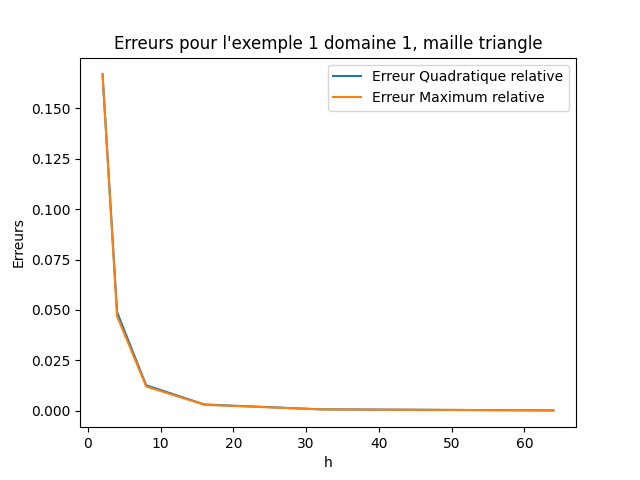
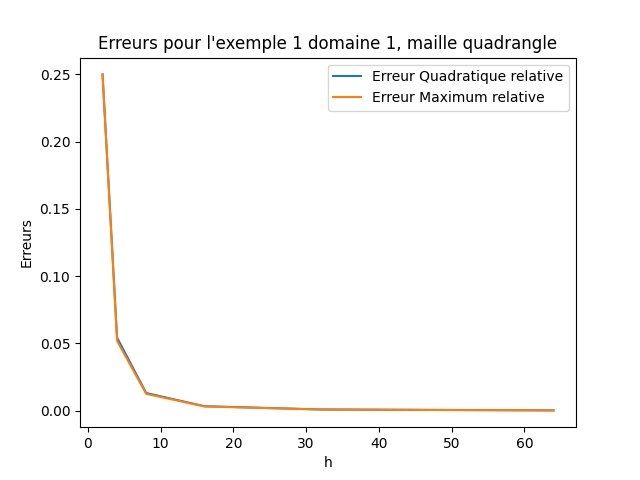
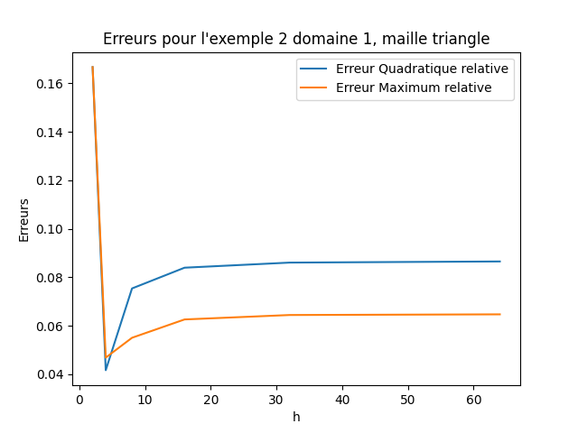
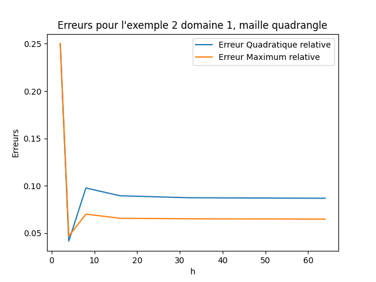

# Rapport projet MEF

Compiler avec `gcc *.c *.o -lm -lgfortran`

## DOMAINE 1: carré [0,1]x[0,1]

* -delta u = fomega
    1. u(x,y) = 16xy(1-x)(1-y) -> fomega = 32(x(1-x)+y(1-y))

    2. u(x,y) = sin(PIx)sin(PIy) -> fomega = 2\*PI²\*sin(PIx)\*sin(PI*y)

* -delta u + u = fomega
    1. u(x,y) = cos(PIx)cos(PIy) -> fomega = (1+PI²)\*cos(PI\*x)\*cos(PI*y)

## Résultats

### Exemple 1

#### Mailles triangles

| Intervalles de subdivision | Erreur quadratique relative | Erreur maximum relative|
|----------------------------|-----------------------------|------------------------|
| 2                          | 0.166666627                 | 0.166666627            |
| 4                          | 4.88969125E-02                 | 4.68750596E-02 |
| 8                          | 1.27263125E-02 | 1.21303797E-02
|16 | 3.21269245E-03 | 3.05956602E-03 |
|32 | 8.10668687E-04 | 7.71760941E-04 |
|64 |2.76404404E-04 | 2.74777412E-04|

 

#### Mailles quadrangle

| Intervalles de subdivision | Erreur quadratique relative | Erreur maximum relative|
|----------------------------|-----------------------------|------------------------|
| 2                          | 0.249999881                 | 0.249999881            |
| 4                          | 5.42131364E-02 | 5.17858267E-02                        |
| 8                          | 1.30608585E-02 | 1.24332905E-02 |
|16 | 3.23418016E-03 | 3.07929516E-03 |
|32 | 8.04639712E-04 | 7.66515732E-04|
| 64 |1.35509676E-04 | 1.21235847E-04|

On remarque que les quadrangles ont tendance à renvoyer une erreur un peu plus faible au final, c'est presue 2 fois plus précis même si pour un *h* plus petit, ce sont les triangles les plus précis.

### Exemple 2

#### Mailles triangles

| Intervalles de subdivision | Erreur quadratique relative | Erreur maximum relative|
|----------------------------|-----------------------------|------------------------|
| 2                          | 0.166666627                 | 0.166666627            |
| 4                          | 4.16751392E-02 | 4.68750596E-02 |
| 8                          | 7.53956437E-02 | 5.50564229E-02 |
|16 |8.39548111E-02 | 6.26113117E-02 |
|32 | 8.60556141E-02 | 6.44405484E-02 |
|64 |8.65243375E-02 | 6.47146106E-02|

 

#### Mailles quadrangle

| Intervalles de subdivision | Erreur quadratique relative | Erreur maximum relative|
|----------------------------|-----------------------------|------------------------|
| 2                          | 0.249999881                 | 0.249999881            |
| 4                          | 4.16751392E-02 | 4.68750596E-02                        |
| 8                          | 9.76941586E-02 | 7.01589882E-02 |
|16 | 8.95330086E-02 |6.57686293E-02 |
|32 | 8.74531567E-02 | 6.52489662E-02|
| 64 |8.68793204E-02 | 6.49208426E-02|

Ce qui est intéressant ici c'est de remarquer que l'erreur est minimale pour *h* = 4 et remonte et se stabilise pour les *h* suivants. J'attribue ce comportement au caractère périodique de l'exmple 2

## Notes

* Le programme ne fonctionne pas pour les conditions de Neumann, mais je ne suis pas loin, ça doit être un problème de maths.
* Le programme contient aussi une fonction pour lire tous les fichiers de maillages pour un même exemple d'un coup, ça ne fonctionne pas à cause de problème avec les jeux de `string`, c'est dommage mais c'était intéressant comme recherches. De toute manière pour ce qui est collecte des résultats, les fonctions fortran sont limitantes, elles demandent toujours des promt dans le terminal.

    
 